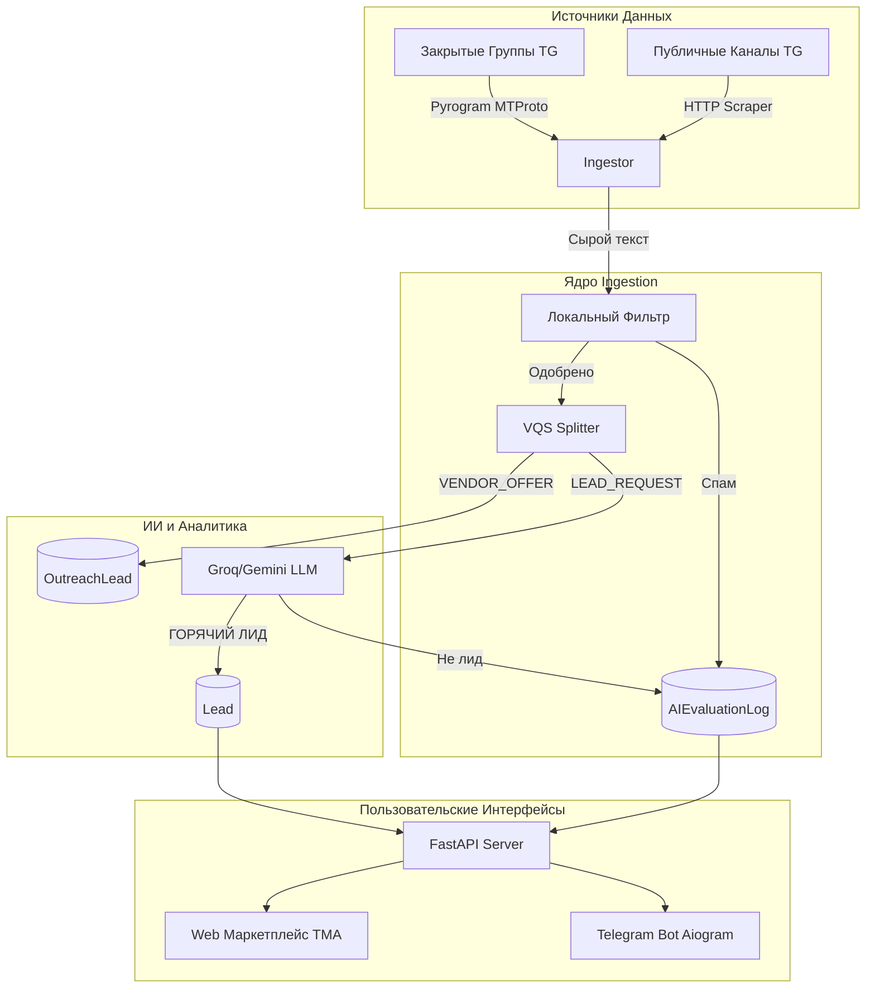

# Архитектура и База Данных

Система построена на асинхронном стеке Python (FastAPI + Aiogram + SQLAlchemy) с использованием SQLite/PostgreSQL в качестве базы данных.

## Высокоуровневая Архитектура (Mermaid)

## Структура Базы Данных (SQLAlchemy)

Модели определены в `src/db/models.py`. Мы используем `AsyncSession` для всех операций.

### 1. Ядро пользователей и биллинга
*   **`Partner` (Партнеры/Пользователи бота):** Основная таблица пользователей (покупателей лидов). Хранит `telegram_id`, `balance`, `role` (DEMO, REGULAR, VIP, SUPERADMIN, ADMIN), `subscribed_niches` и настройки.
*   **`LeadPurchase` (Покупки):** Транзакционная таблица. Связывает `Partner` и `Lead`. Гарантирует, что один пользователь не купит одного лида дважды.

### 2. Ядро лидов
*   **`Lead` (Квалифицированные B2C Лиды):** Сообщения, которые ИИ признал лидами. Содержит `intent_summary`, `sales_hook`, `confidence_score`, `niche_code` и `status` (AVAILABLE, SOLD, EXPIRED, CLAIMED).
*   **`OutreachLead` (B2B Подрядчики):** Вторая воронка. Сюда попадают пользователи, предлагающие услуги (VQS >= 40). Используются для автоматического аутрича (продажи доступа к платформе).
*   **`HRVacancy` (Вакансии):** Отдельная таблица для парсинга вакансий (если подключен соответствующий модуль).

### 3. Телеметрия и Логи (Высоконагруженные таблицы)
Эти таблицы постоянно растут и контролируются сборщиком мусора `db_guard.py`.
*   **`UserActivityLog`:** Хранит сырые сообщения из Telegram, чтобы ИИ мог анализировать контекст (предыдущие сообщения пользователя).
*   **`AIEvaluationLog`:** Логи рассуждений ИИ (Chain-of-Thought) и отклоненный Gatekeeper'ом спам. Обеспечивает прозрачность в веб-интерфейсе "ИИ Логи".
*   **`CollectorLog`:** Статистика работы юзербота (сколько постов проверено в каждом канале, время опроса).

### 4. Инфраструктура сбора данных
*   **`MonitoredChannel`:** Одобренные каналы для сканирования. Содержит `last_scraped_msg_id` для отслеживания прогресса.
*   **`ChannelCandidate`:** Каналы, найденные автоматически по упоминаниям (discovery_engine). Ждут одобрения администратора или ИИ-скаута.
*   **`BlacklistedChat` & `BlacklistedUser`:** Черные списки для защиты от спам-атак и бесполезных каналов.

> [!WARNING]
> При добавлении новых колонок в БД не забывайте использовать `default` или `server_default`, так как в проекте сейчас не используется Alembic для миграций. База инициализируется через `Base.metadata.create_all`.
